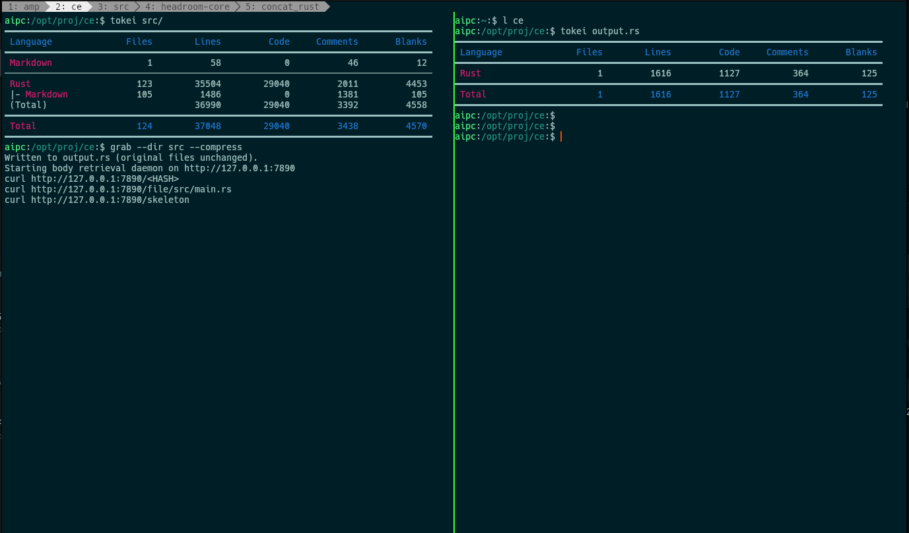
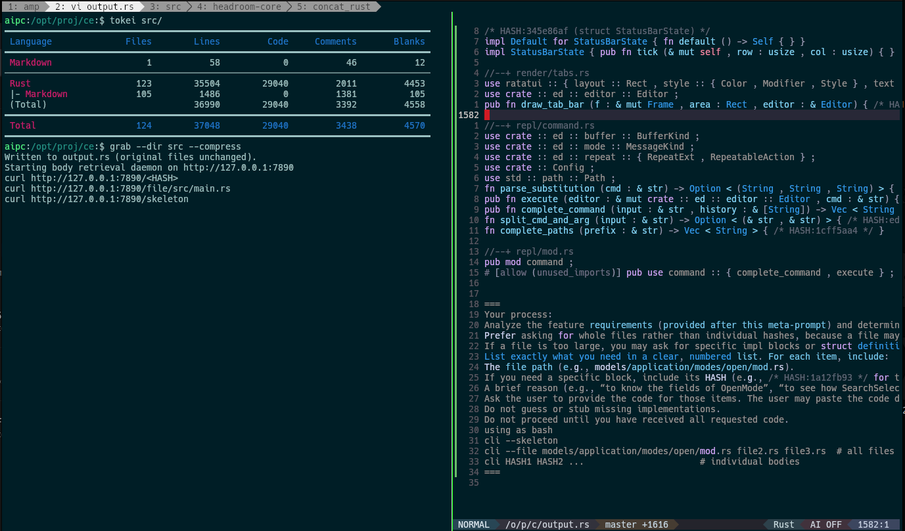
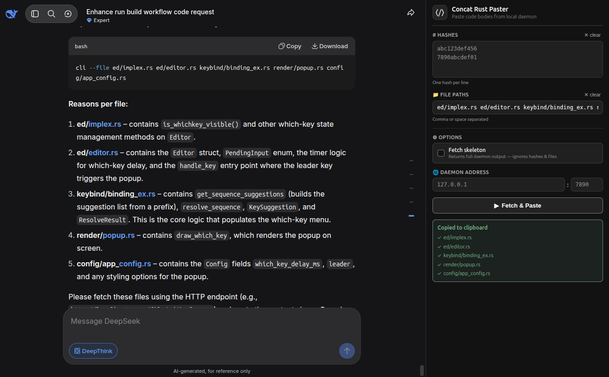
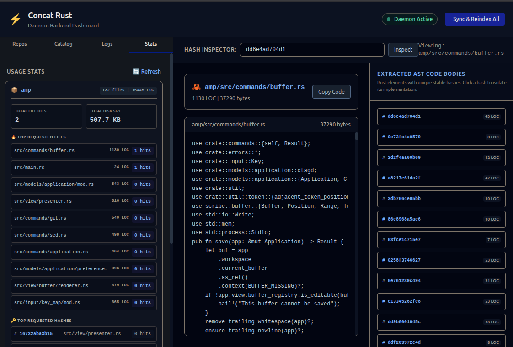
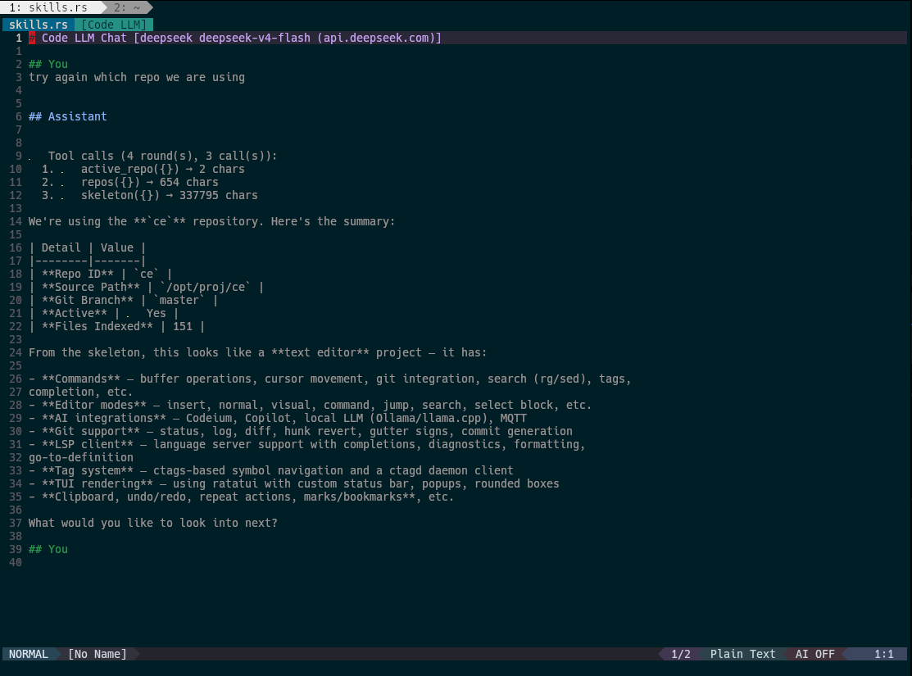

# concat_rust (v2)

**Provide the overall architecture first, then retrieve specific implementations on demand.**

---

## Motivation

Most real-world Rust codebases are too large for free-tier web-based AI chats (such as the web interfaces for Claude, ChatGPT, or Gemini). If you paste your entire codebase, you will quickly hit context window limits, trigger silent truncation, or deplete your high-quality message quota. Conversely, if you paste only isolated files, the model lacks the structural context of your architecture and struggles to align with your project's traits, module boundaries, and type definitions.

`concat_rust` was designed specifically for developers using **free-tier web interfaces** or **budget-constrained API endpoints**. It splits your codebases into:
1. A lightweight, multi-repository **architectural skeleton** that easily fits within a single chat prompt.
2. An **on-demand retrieval daemon** that lets you fetch and paste exact implementations (either raw files or specific AST bodies) only when the model requests them.

---





---

## Key Features in v2

* **Multi-Repository Management**: Track, sync, and catalog multiple independent repositories through a single centralized daemon copy (`.concat_rust_central`).
* **Active Web Dashboard**: Run an interactive control panel at `http://localhost:7890` displaying repository health, a fully searchable file/code catalog, client access logs, and precise usage stats (e.g., top-requested files and hashes).
* **Deterministic File Fingerprinting**: Uses file sizes, modification times, and SHA-256 content hashing to determine dirty files. Avoids full re-indexing of untouched files during sync.
* **Three-Tier Scanning Engine**:
  * **Rust (`.rs`)**: Performs AST-level parsing to extract signatures, collapse function/impl blocks, and assign unique, deterministic 12-char hashes.
  * **Structured (`.toml`, `.yml`, `.json`, `.sql`, `.proto`, `.env`)**: Strips comments, collapses unnecessary whitespace, and preserves critical structural code.
  * **Raw (`.md`, `.sh`)**: Served as-is without AST-level transformations.
* **Stateful CLI Client**: Saves an "active" repository state so you can use shortened paths (e.g., `main.rs` instead of `core/src/main.rs`). Automatically resolves missing directories and auto-prefixes `src/` where appropriate.
* **Integrated Chrome Extension**: Instantly fetches files and code hashes from your local daemon and inserts them directly into web chat interfaces (such as Claude, ChatGPT, or Gemini), removing the manual copy-and-paste cycle from the terminal.

---

## Architecture & Workflow

```
 ┌──────────────┐
 │ Repository A │ ──┐
 └──────────────┘   │  sync       ┌──────────────────────┐  API   ┌────────────────┐
 ┌──────────────┐   ├───────────► │ Central Mirror       │ ─────► │  AI Web Chat   │
 │ Repository B │ ──┘             │ .concat_rust_central │ ◄───── │  (Free Tier)   │
 └──────────────┘                 └──────────────────────┘        │ Sees skeleton, │
                                             │                    │ requests code  │
                                             ▼                    └────────────────┘
                                  ┌──────────────────────┐                 ▲
                                  │ Web Dashboard / UI   │                 │
                                  │ localhost:7890       │ ◄───────────────┘
                                  └──────────────────────┘     CLI fetch
```

1. **Skeleton Generation**: Functions, impls, structs, enums, and traits are hashed and stubbed.
   ```rust
   // Original code:
   fn process_order(order: &Order) -> Result<Receipt, Error> {
       let validated = order.validate()?;
       let total = validated.items.iter().map(|i| i.price).sum();
       let tax = calculate_tax(total, &validated.region);
       let receipt = Receipt::new(validated, total, tax);
       database::persist(&receipt)?;
       notify_customer(&receipt)?;
       Ok(receipt)
   }

   // Skeleton output:
   fn process_order(order: &Order) -> Result<Receipt, Error> { /* HASH:a1b2c3d4e5f6 [8 LOC] */ }
   ```
2. **Retrieve on Demand**: The model reviews the skeleton structure and asks for specific files or block hashes. You run the CLI or use the Web Dashboard to fetch them instantly.

---

## Why This Helps Free-Tier Users

Free-tier web interfaces for AI models often impose tight constraints on both context window size and the number of messages allowed per session. This tool helps optimize both constraints:

| Problem in Free-Tier Web Chats | How `concat_rust` Addresses It |
| :--- | :--- |
| **Small Context Windows** | The skeleton is typically 5–15% of the original codebase size, fitting easily within standard limits. |
| **Strict Message Limits** | Sharing the entire architecture upfront reduces the need for back-and-forth clarification, saving your daily message quota. |
| **Tedious Manual Pasting** | The CLI copies code directly to your clipboard, and the Chrome extension pastes it directly into the chat interface. |
| **Out-of-Context Hallucinations** | Because the model can see all trait bounds and type definitions in the skeleton, it is less likely to guess or invent non-existent APIs. |
| **Performance Degradation** | Keeping the active context small and highly relevant helps the model provide more focused and accurate code generations. |

### Typical Compression Ratio Example

* **Original Project**: ~12,400 lines of code (~52,000 tokens) — *often exceeds practical free-tier context limits.*
* **Skeleton**: ~1,800 lines of code (~7,500 tokens) — *well within typical free-tier limits.*
* **Per-Fetch Body**: ~50–200 lines (~200–800 tokens) — *minimal token overhead for targeted updates.*

---

## Quick Start

### 1. Build the Project
Compile the daemon and the CLI client in release mode:
```bash
cargo build --release
```

### 2. Start the Daemon
Launch the background daemon. By default, it manages mirrors inside `.concat_rust_central` and listens on port `7890`:
```bash
./target/release/concat_rust --port 7890
```

### 3. Register and Sync Repositories
You can register and sync repositories via the CLI or by navigating to the Web Dashboard at `http://localhost:7890`.

To register a repository via the CLI:
```bash
# syntax: cli add-repo <id> <absolute_path_or_dot>
./target/release/concat_rust_cli add-repo my-api .
```

To sync changes manually:
```bash
./target/release/concat_rust_cli sync
```

### 4. Set the Active Repo Context
To avoid typing the repository prefix on every subsequent command, set it as active:
```bash
./target/release/concat_rust_cli use my-api
```

### 5. Fetch the Skeleton
Copy the full system skeleton directly to your clipboard:
```bash
./target/release/concat_rust_cli skeleton
```
*Tip: Paste this skeleton into your AI web chat window.*

### 6. Retrieve Code Details
When the AI asks to inspect certain functions or files, run the retrieval command. The CLI automatically copies the requested content to your clipboard:
```bash
# Fetch specific function/impl blocks by hash
./target/release/concat_rust_cli a1b2c3d4e5f6

# Fetch entire files (automatically resolves active repo and src/ paths)
./target/release/concat_rust_cli main.rs db.rs
```

---
Chrome Extension

A companion Chrome extension is included in the ext/ directory. It connects directly to your local daemon at http://localhost:7890 and automates code retrieval, allowing you to load requested code blocks and insert them directly into web-based AI chats without switching back and forth to your terminal.
Installation

    Navigate to chrome://extensions/ in Google Chrome.

    Enable Developer mode (toggle in the top-right corner).

    Click Load unpacked and select the ext/ directory in this project.

Automating Code Pastes

    Direct Paste: Use the Extension side panel to enter requested hashes or paths (e.g., a1b2c3d4e5f6 or src/main.rs). The extension retrieves the code from your local daemon and inserts it into the active chat window input box.

    Context Menu Integration: Highlight any hash or file path on the webpage, right-click, and select "Fetch with Concat Rust" to inject the code segment into the message prompt box.

    Custom Configurations: Persistent settings allow you to update the daemon's host and port directly inside the extension settings pane.

---

## CLI Command Reference (`concat_rust_cli`)

```
Usage: concat_rust_cli [OPTIONS] <COMMAND>

Commands:
  use         Set the active repository ID context (saves to ~/.concat_rust/active)
  active      Show the currently active repository
  repos       List all registered repositories, active branch, and sync status
  add-repo    Register a new local repository directory under a unique slug ID
  remove-repo Remove a repository from registry tracking
  sync        Sync modified files from registered sources into the central mirror
  catalog     Display the index catalog showing LOC, body counts, and large hashes
  skeleton    Fetch the structural skeleton (copies to clipboard or writes to file)
  file        Retrieve complete cleaned files (accepts comma-separated lists)
  hash        Retrieve raw code blocks matching specific SHA hashes
  info        Inspect file metadata, size, and contained AST hashes

Options:
      --host <HOST>          Daemon address [default: 127.0.0.1]
      --port <PORT>          Daemon port [default: 7890]
      --warn-loc <WARN_LOC>  Warning threshold for massive clipboard writes [default: 3000]
```

---

## Daemon API Reference

The background daemon exposes a structured JSON and plaintext API for custom tooling:

| Endpoint | Method | Description |
| :--- | :--- | :--- |
| `/` or `/dashboard` | `GET` | HTML control panel interface. |
| `/skeleton` | `GET` | Plaintext compressed skeleton. Accepts optional `?repo=<id>` filter. |
| `/catalog` | `GET` | JSON representation of all indexed files, sizes, and top hashes. |
| `/file/*path` | `GET` | Plaintext content of the file. |
| `/file-info/*path`| `GET` | JSON metadata of a file. |
| `/:hash` | `GET` | Plaintext body matching hash. Supports multiple separated by `+` or `,`. |
| `/info/:hash` | `GET` | JSON metadata of body hashes. |
| `/repos` | `GET` | JSON array of registered repositories. |
| `/repos` | `POST` | Register a new repository. Expects `{ "id": "slug", "source_path": "/path" }`. |
| `/repos/:id` | `DELETE` | Unregister a repository. |
| `/sync` | `POST` | Sync local changes and update index caches. |
| `/stats` | `GET` | JSON registry access statistics. |
| `/logs` | `GET` | JSON list of request events. |

---

## Interactive Dashboard

The daemon-hosted Web Dashboard offers a streamlined visual workspace:
* **Repository Mirror Setup**: Point to local folders to register them instantly.
* **Searchable Catalog**: Filter file paths instantly and view AST hash compositions side-by-side.
* **Usage Heatmaps**: See which files and hashes are requested most often.
* **Activity Stream**: Real-time logging of HTTP request methods, status codes, and user-agent types.

---

## License

This project is licensed under the [MIT License](LICENSE).
